16 августа в СК «Знаменский» прошла тренировка сборной команды г. Краснодара по Всестилевому каратэ в дисциплине «полный контакт». Также были подведены итоги первого полугодия.

Два спортсмена, входящие в состав сборной, - Цыганок Мирослав и Каширин Владислав - получили денежную премию в размере 10 000 рублей за наибольшее количество призовых мест, завоёванных в соревнованиях по Всестилевому каратэ.

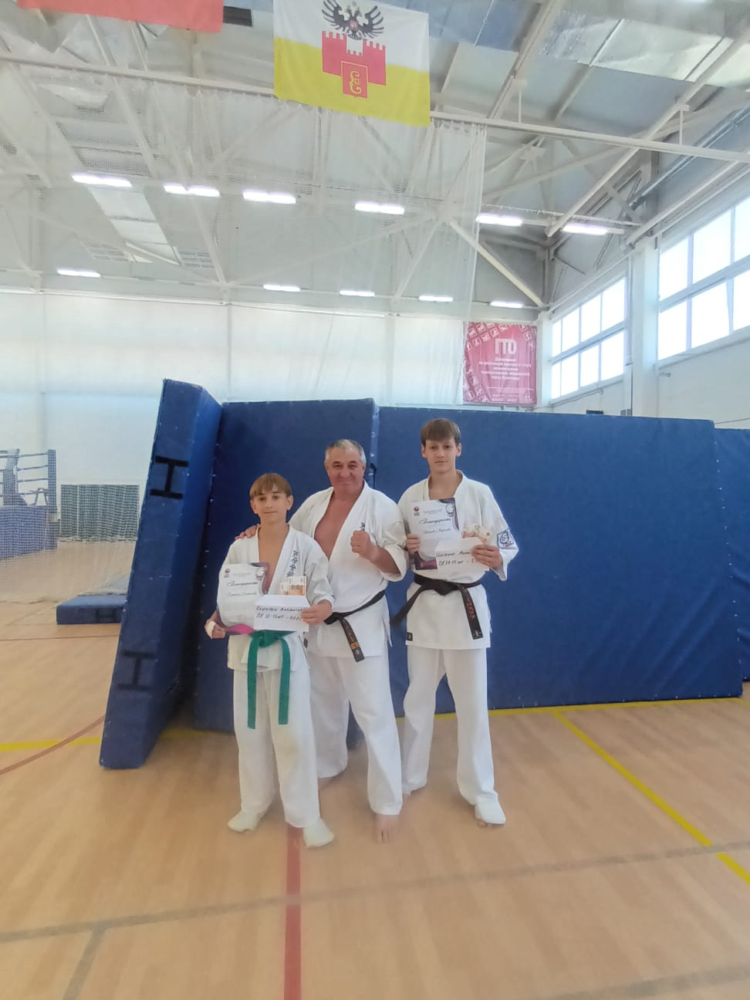

Поздравляем наших спортсменов!

## Фоторепортаж

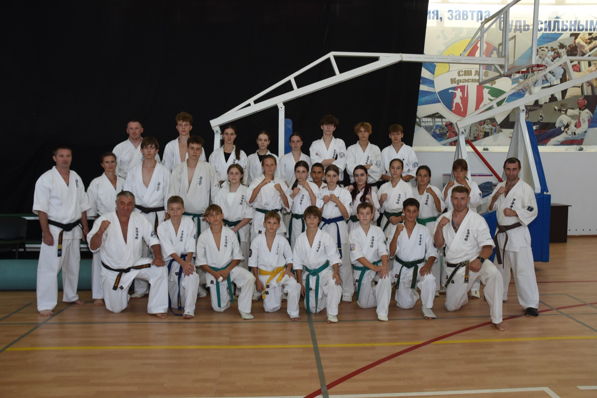

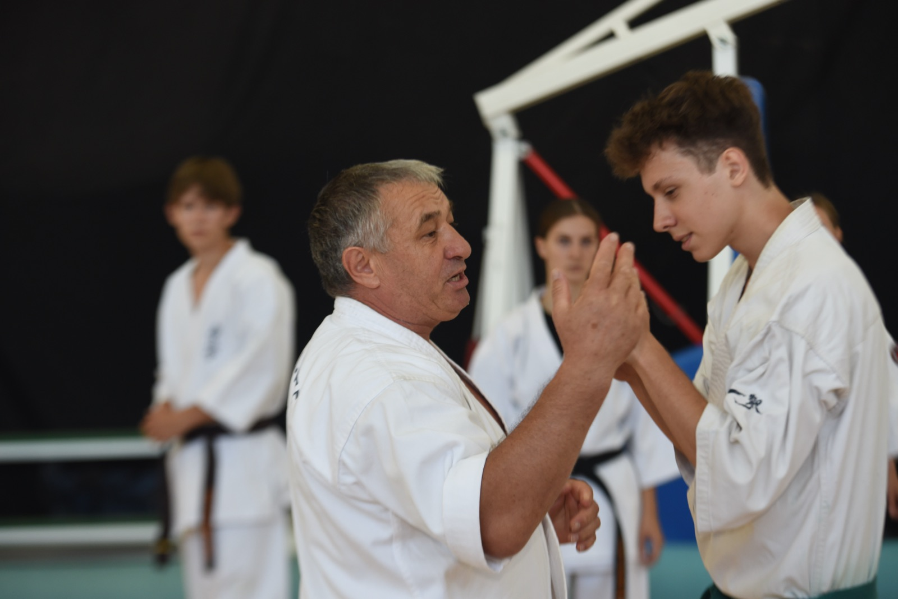

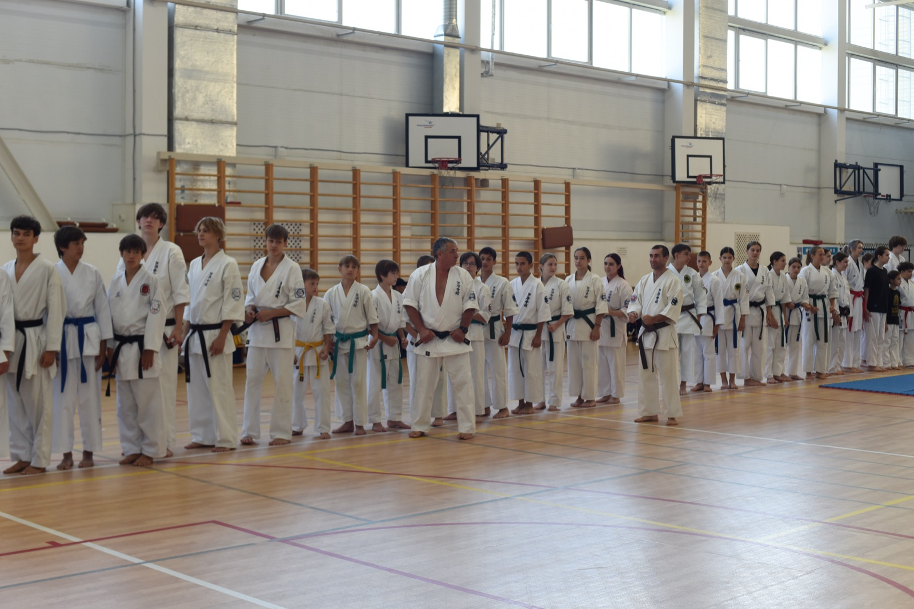

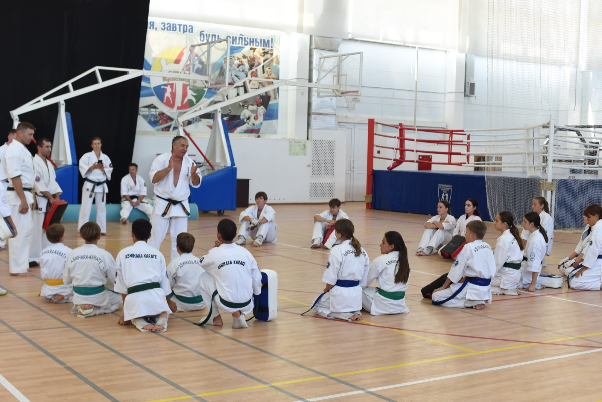

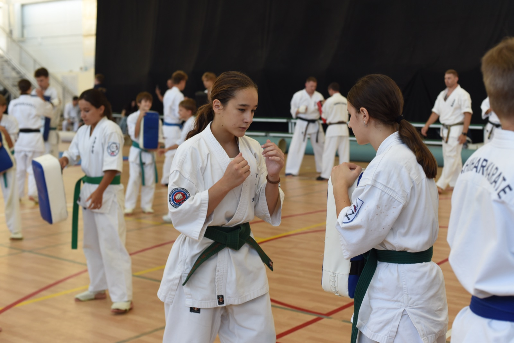

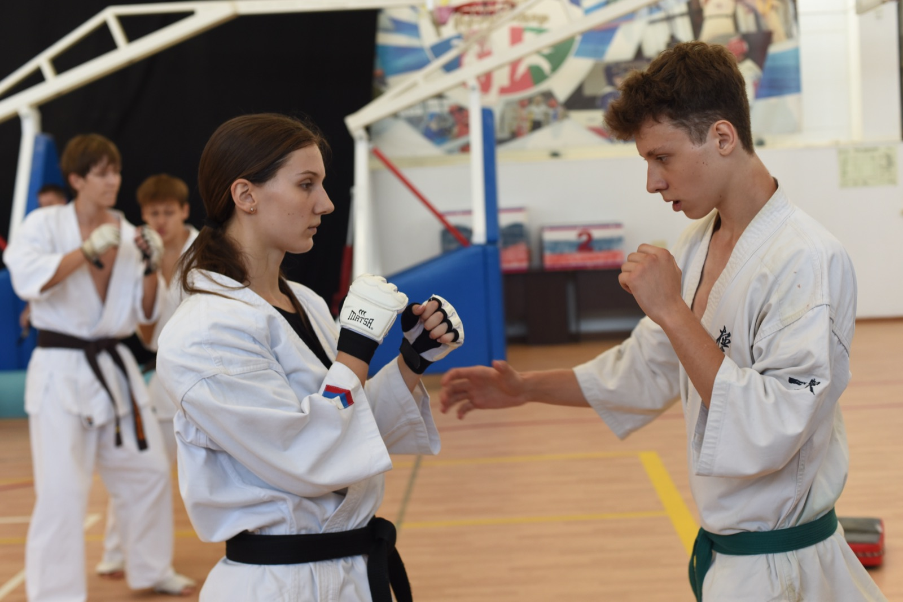

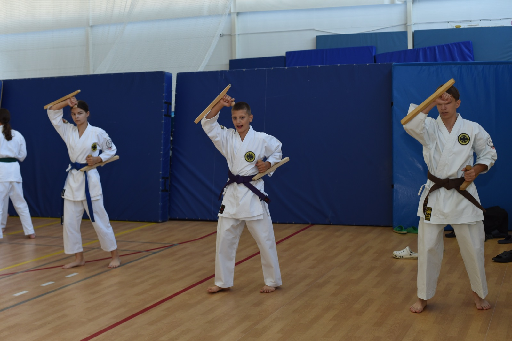

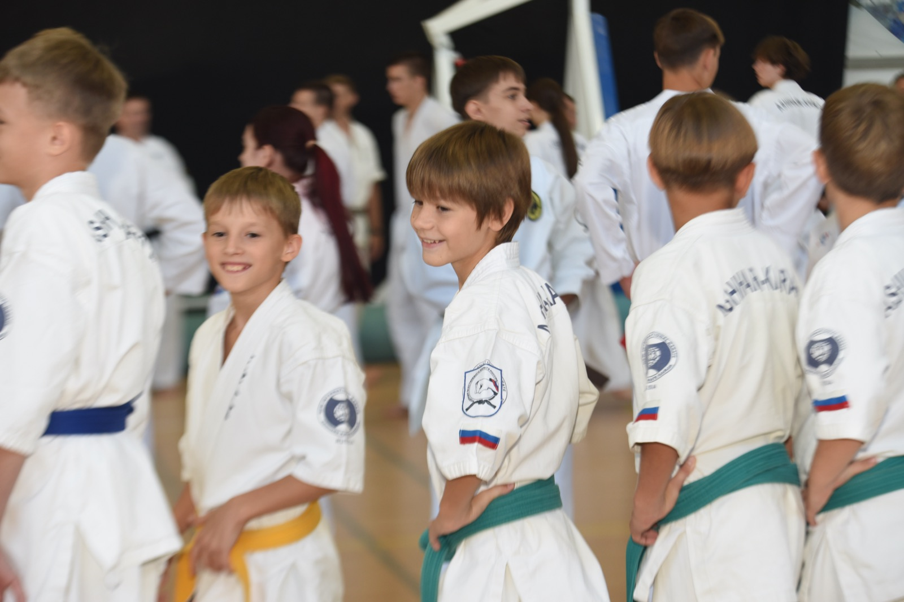

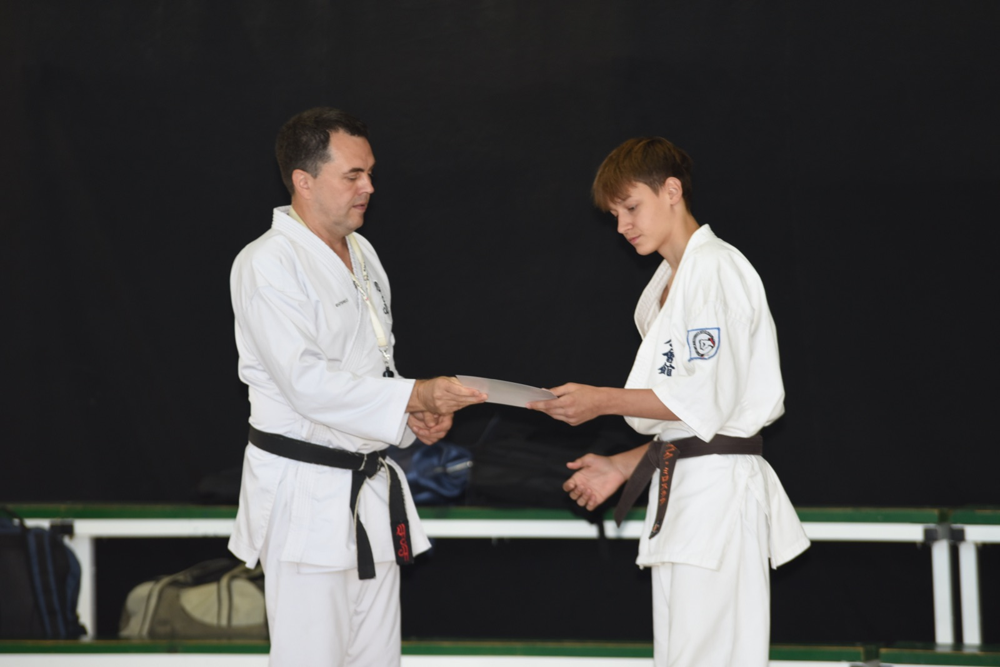

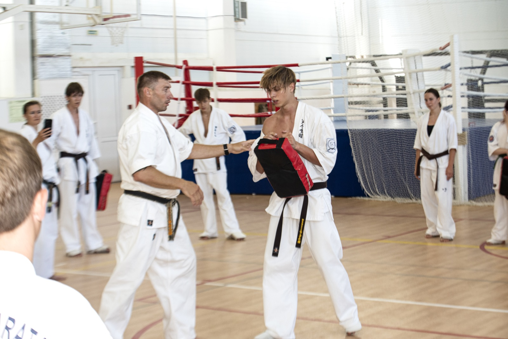
